# Pemograman Web2 Pertemuan 11

## Profil
| #               | Biodata                      |
| --------------- | ---------------------------- |
| **Nama**        | M. AKMAL AL ABDILAH          |
| **NIM**         | 312110034                    |
| **Kelas**       | TI.21.A.1                    |
| **Mata Kuliah** | Pemrograman Web 2            |

<p align="center">
 
</p>
<p align="center">
<a href="https://github.com/akmalabdilah"></a>
<p align="center">

<hr>

# Praktikum 9: Framework Lanjutan (Modul Login)

<hr>

**Instruksi Praktikum**<br>
1. Persiapkan text editor misalnya VSCode.
2. Buka kembali folder dengan nama lab11_php_ci pada docroot webserver (htdocs)
3. Ikuti langkah-langkah praktikum yang akan dijelaskan berikutnya.

**Langkah-langkah Praktikum**<br>
**Persiapan.**<br>
Untuk memulai membuat modul Login, yang perlu disiapkan adalah database server 
menggunakan MySQL. Pastikan MySQL Server sudah dapat dijalankan melalui 
XAMPP.<br>
**Membuat Tabel: User Login**

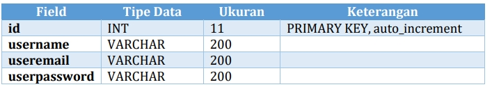

Gambar 1.Tabel user Login

**Membuat Tabel User**
```
CREATE TABLE user (
 id INT(11) auto_increment,
 username VARCHAR(200) NOT NULL,
 useremail VARCHAR(200),
 userpassword VARCHAR(200),
 PRIMARY KEY(id)
);
```
Selanjutnya Buka Url : <http://localhost/phpmyadmin/index.php?route=/database/sql&db=lab_ci4>

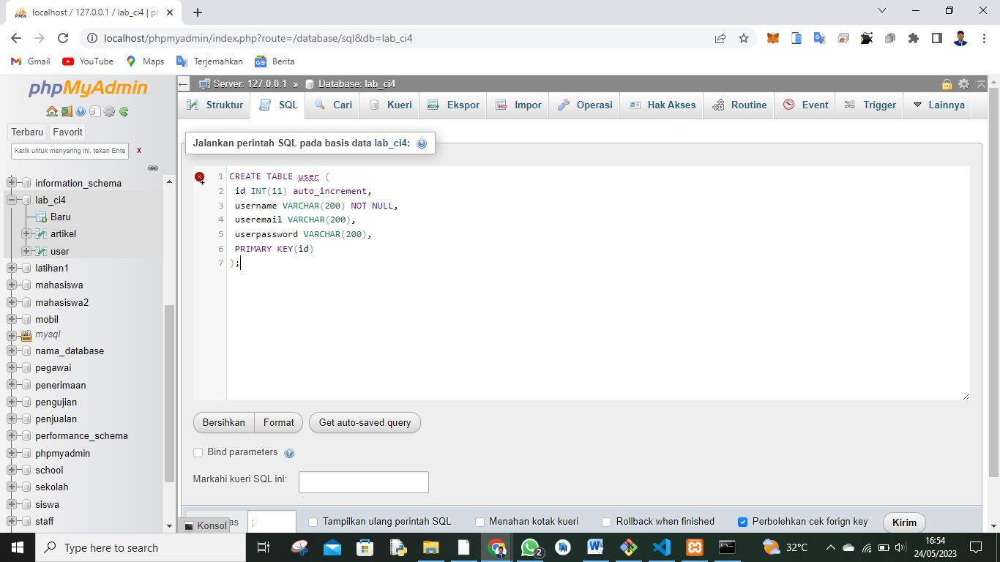
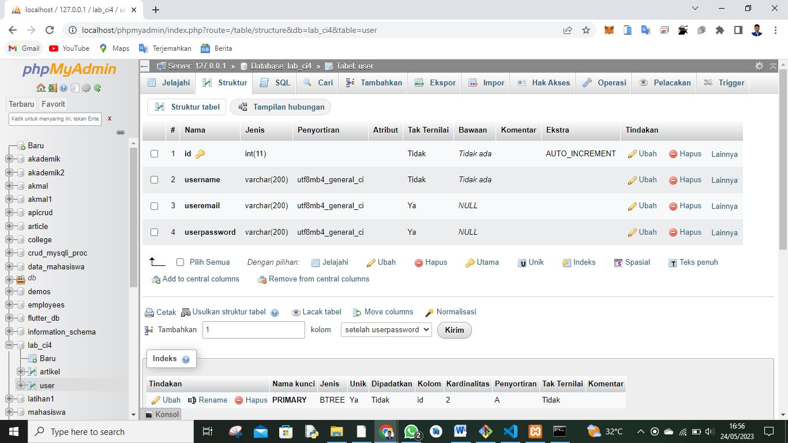

Gambar 2.MySQL Server User Login

**Membuat Model User**<br>
Selanjutnya adalah membuat Model untuk memproses data Login. Buat file baru pada 
direktori ***app/Models*** dengan nama ***UserModel.php***
```
<?php
namespace App\Models;
use CodeIgniter\Model;
class UserModel extends Model
{
 protected $table = 'user';
 protected $primaryKey = 'id';
 protected $useAutoIncrement = true;
 protected $allowedFields = ['username', 'useremail', 'userpassword'];
}
```
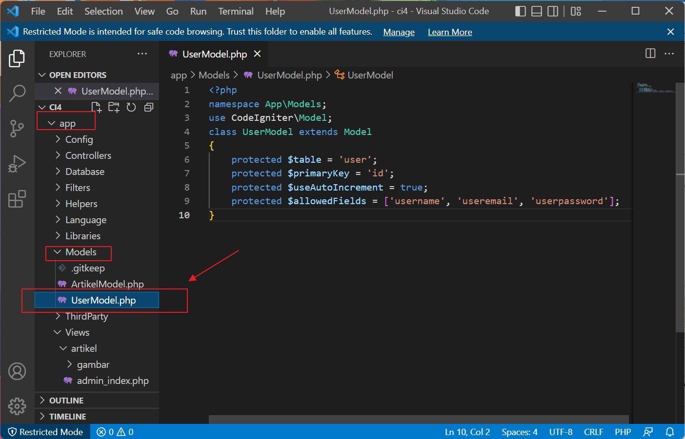

Gambar 3.UserModel.php

**Membuat Controller User**<br>
Buat Controller baru dengan nama **User.php** pada direktori **app/Controllers**.
Kemudian tambahkan method **index()** untuk menampilkan daftar user, dan method 
**login()** untuk proses login.
```
<?php
namespace App\Controllers;
use App\Models\UserModel;
class User extends BaseController
{
 public function index() 
 {
 $title = 'Daftar User';
 $model = new UserModel();
 $users = $model->findAll();
 return view('user/index', compact('users', 'title'));
 }
 public function login()
 {
 helper(['form']);
 $email = $this->request->getPost('email');
 $password = $this->request->getPost('password');
 if (!$email)
 {
 return view('user/login');
 }
 $session = session();
 $model = new UserModel();
 $login = $model->where('useremail', $email)->first();
 if ($login)
 {
 $pass = $login['userpassword'];
 if (password_verify($password, $pass))
 {
 $login_data = [
'user_id' => $login['id'],
 'user_name' => $login['username'],
 'user_email' => $login['useremail'],
 'logged_in' => TRUE,
 ];
 $session->set($login_data);
 return redirect('admin/artikel');
 }
 else
 {
 $session->setFlashdata("flash_msg", "Password salah.");
 return redirect()->to('/user/login');
 }
 }
 else
 {
 $session->setFlashdata("flash_msg", "email tidak terdaftar.");
 return redirect()->to('/user/login');
 }
 }
}
```
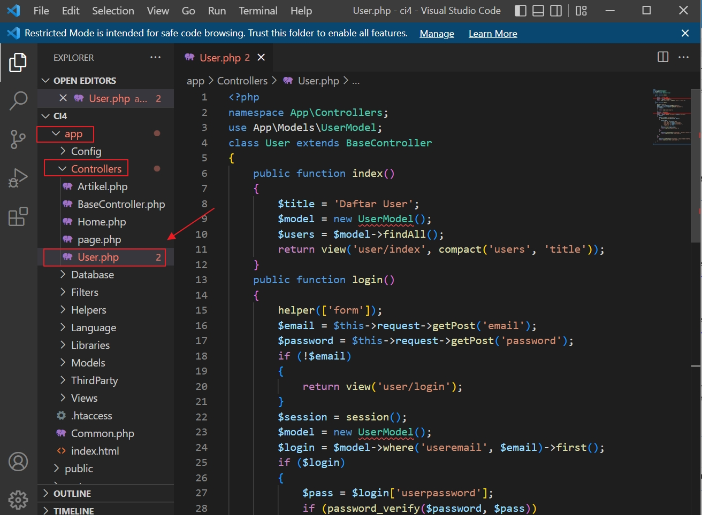
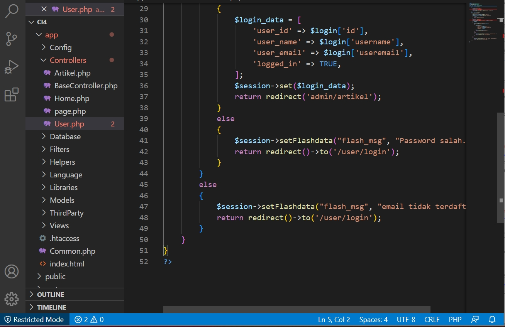

Gambar 4.Membuat Controller User.php


**Membuat View Login**<br>
Buat direktori baru dengan nama **user** pada direktori **app/views**, kemudian buat file 
baru dengan nama **login.php**.
```
<!DOCTYPE html>
<html lang="en">
<head>
 <meta charset="UTF-8">
 <title>Login</title>
 <link rel="stylesheet" href="<?= base_url('/loginstyle.css');?>">
</head>
<body>
 <div id="login-wrapper">
 <h1>Sign In</h1>
 <?php if(session()->getFlashdata('flash_msg')):?>
 <div class="alert alert-danger"><?=
session()->getFlashdata('flash_msg') ?></div>
 <?php endif;?>
 <form action="" method="post">
 <div class="mb-3">
 <label for="InputForEmail" class="form-label">Email 
address</label>
 <input type="email" name="email" class="form-control"
id="InputForEmail" value="<?= set_value('email') ?>">
 </div>
<div class="mb-3">
 <label for="InputForPassword"
class="form-label">Password</label>
 <input type="password" name="password"
class="form-control" id="InputForPassword">
 </div>
 <button type="submit" class="btn 
btn-primary">Login</button>
 </form>
 </div>
</body>
</html>
```
Selanjutnya Kita Buat CSS baru di C:\xampp\htdocs\lab11_php_ci\ci4\public Dengan nama : **loginstyle.css**

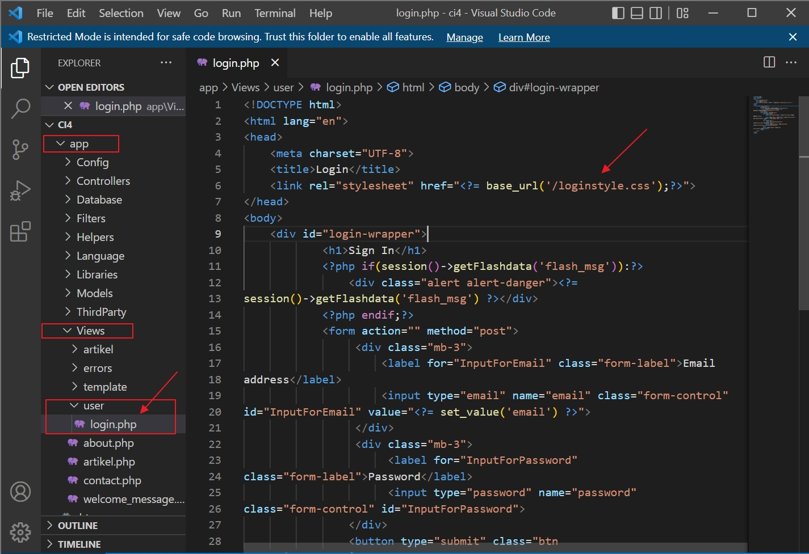

Gambar 5.Membuat View Login.php

**Membuat Database Seeder**<br>
Database seeder digunakan untuk membuat data dummy. Untuk keperluan ujicoba modul 
login, kita perlu memasukkan data user dan password kedaalam database. Untuk itu buat 
database seeder untuk tabel user. Buka CLI, kemudian tulis perintah berikut:

**`php spark make:seeder UserSeeder`**

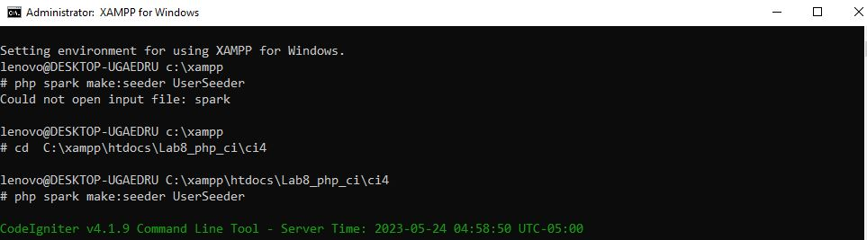

Gambar 6.CLI_UserSeeder

Selanjutnya, buka file **UserSeeder.php** yang berada di lokasi direktori 
**/app/Database/Seeds/UserSeeder.php** kemudian isi dengan kode berikut:
```
<?php
namespace App\Database\Seeds;
use CodeIgniter\Database\Seeder;
class UserSeeder extends Seeder
{
public function run()
{
$model = model('UserModel');
$model->insert([
'username' => 'admin',
'useremail' => 'admin@email.com',
'userpassword' => password_hash('admin123', PASSWORD_DEFAULT),
]);
}
}
```
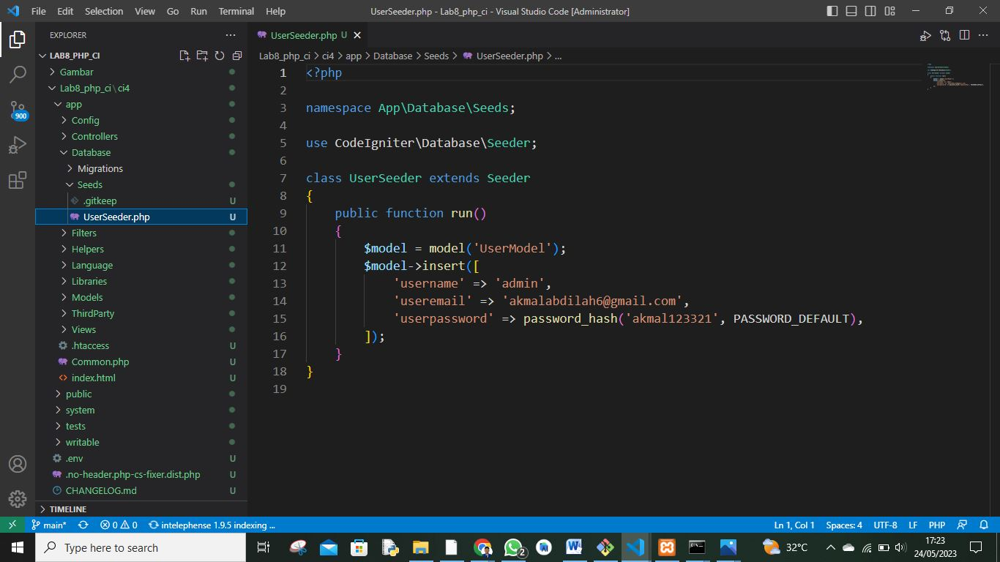

Gambar 7.Membuat CLI_UserSeeder.php

Selanjutnya buka kembali CLI dan ketik perintah berikut:

**`php spark db:seed UserSeeder`**

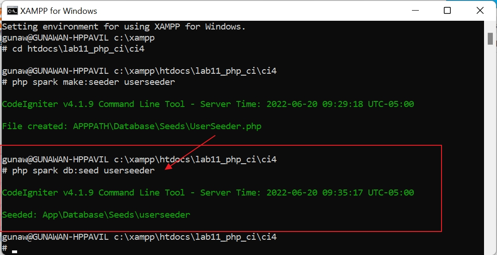

Gambar 8.CLI_seedUserSeeder

**Uji Coba Login**<br>
Selanjutnya buka url http://localhost:8080/user/login seperti berikut:

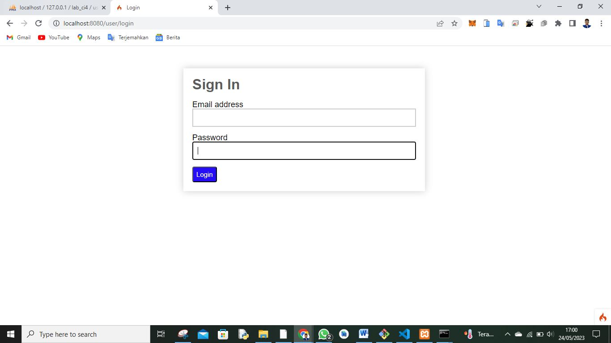

Gambar 9.Login Form

**Menambahkan Auth Filter**

Selanjutnya membuat filer untuk halaman admin. Buat file baru dengan nama **Auth.php**
pada direktori **app/Filters.**
```
<?php namespace App\Filters;
use CodeIgniter\HTTP\RequestInterface;
use CodeIgniter\HTTP\ResponseInterface;
use CodeIgniter\Filters\FilterInterface;
class Auth implements FilterInterface
{
public function before(RequestInterface $request, $arguments = null)
{
// jika user belum login
if(! session()->get('logged_in')){
// maka redirct ke halaman login
return redirect()->to('/user/login');
}
}
public function after(RequestInterface $request, ResponseInterface
$response, $arguments = null)
{
// Do something here
}
}
?>
```
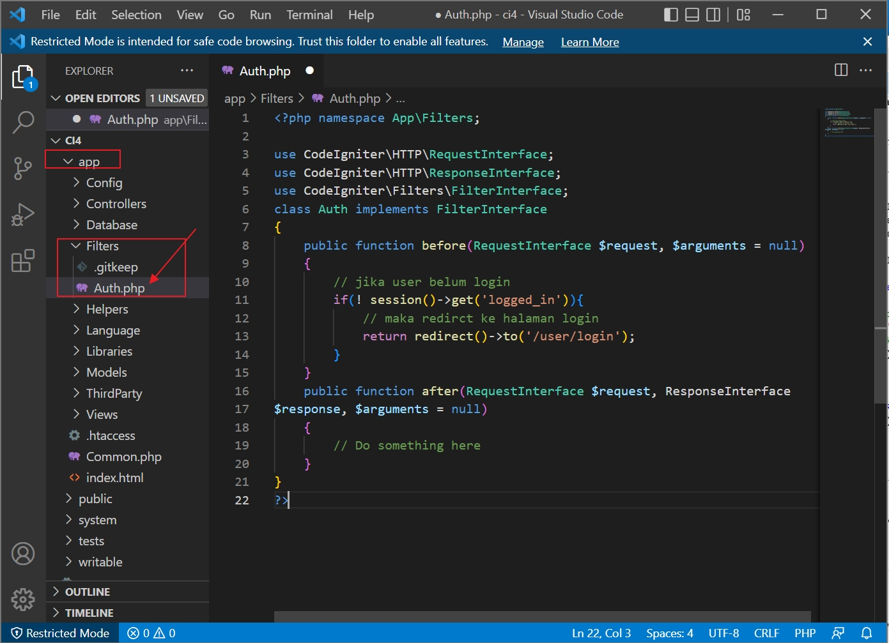

Gambar 10.Membuat Auth.php

Selanjutnya buka file **app/Config/Filters.php** tambahkan kode berikut:
```
'auth' => \App\Filters\Auth::class
```
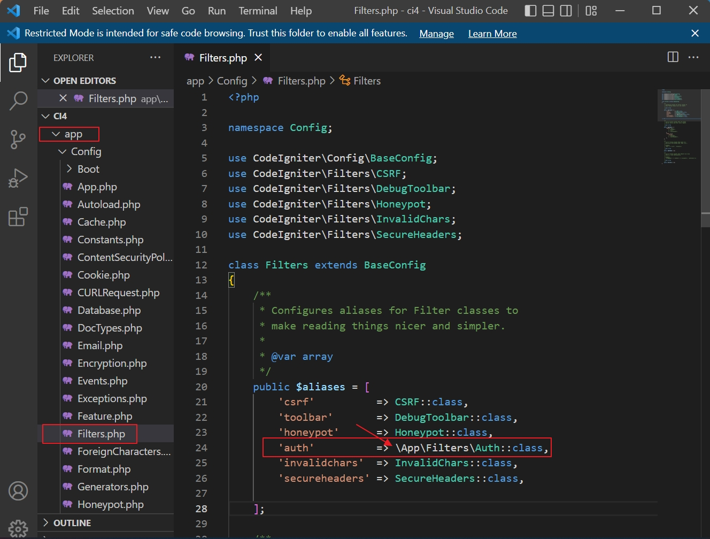

Gambar 11.Config Filters

Selanjutnya buka file **app/Config/Routes.php** dan sesuaikan kodenya.

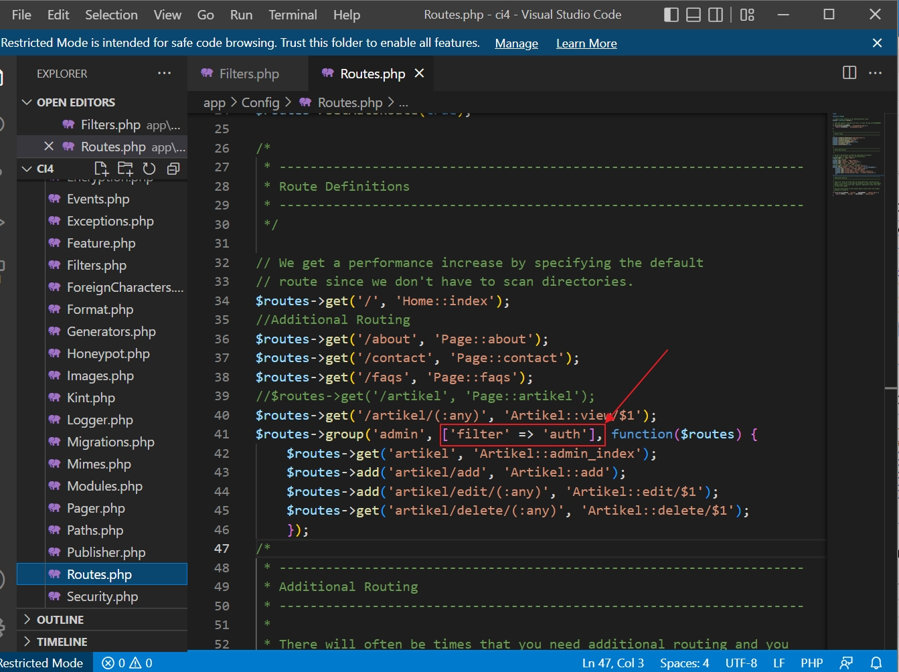

Gambar 12.Config Routes

Percobaan Akses Menu Admin<br>
Buka url dengan alamat http://localhost:8080/admin/artikel<br>
ketika alamat tersebut
diakses maka, akan dimuculkan halaman login.


Gambar 13.Login Admin

**Fungsi Logout**

Tambahkan method logout pada Controller User seperti berikut:
```
public function logout()
{
session()->destroy();
return redirect()->to('/user/login');
}
```
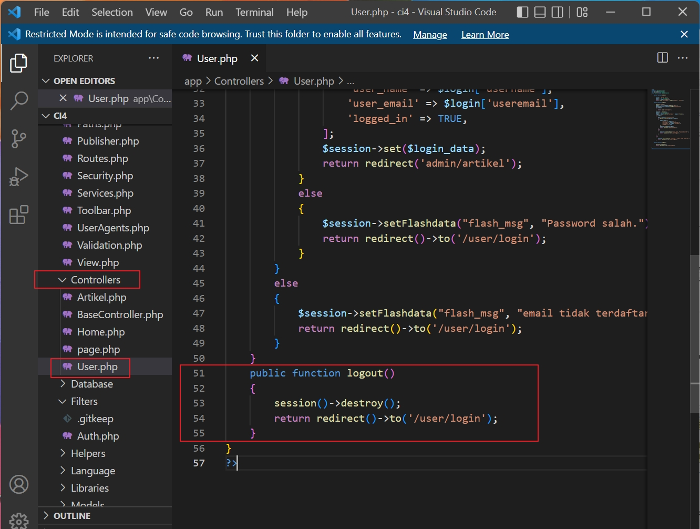

Gambar 14.Menambah Fungsi_Logout

<hr>

# Pertanyaan dan Tugas

<hr>

**`Selesaikan programnya sesuai Langkah-langkah yang ada. Anda boleh melakukan
improvisasi.`**

> **Jawab:**

Saya Tambahkan Routes Logout di C:\xampp\htdocs\lab11_php_ci\ci4\app\Config :

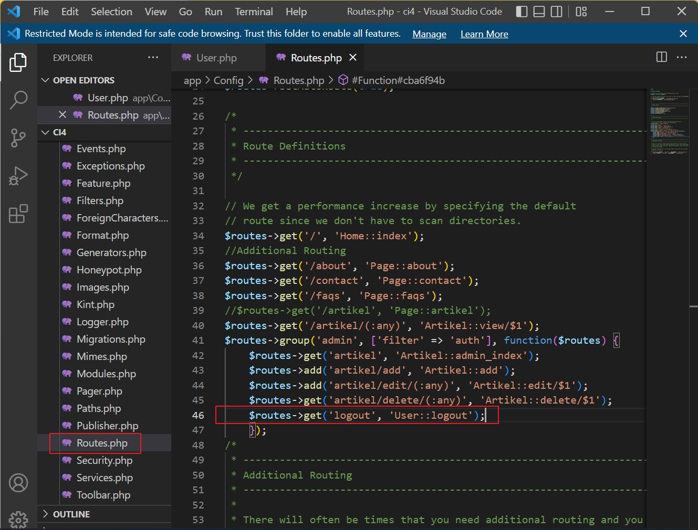

Gambar 15.Menambah Fungsi_Logout

# **`Login Admin`**

Buka url dengan alamat http://localhost:8080/artikel<br>
Selanjutnya saya coba masuk Login dengan memasukkan kode :

**`Email :akmalabdilah6@gmail.com`**<br>
**`Password :akmal123321`**

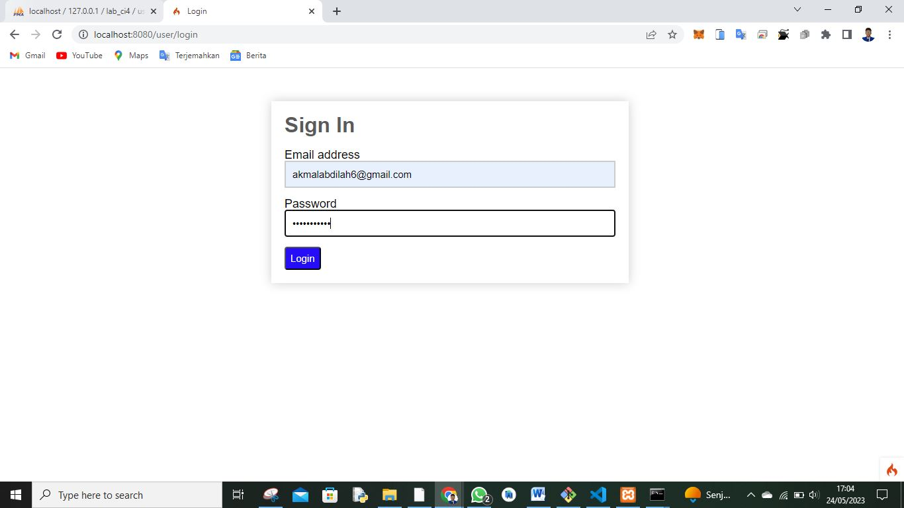

Gambar 16. Login_admin

Apabila Email Dan Password Benar, Maka akan Masuk Ke halaman Admin Portal Berita :

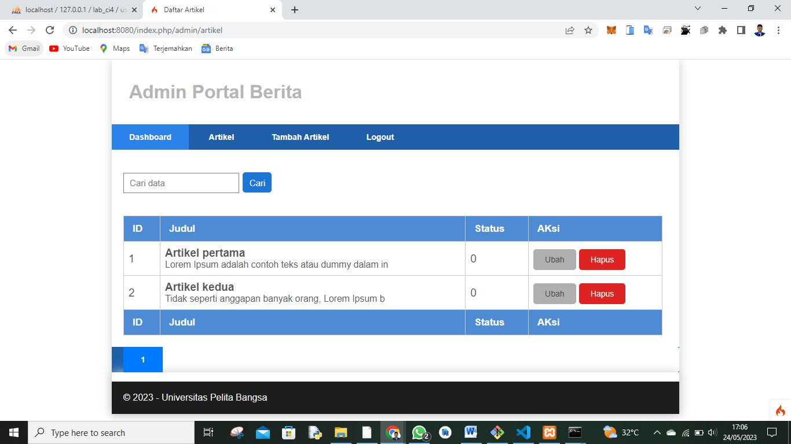

Gambar 17. Login_admin

Dan apabila kita memasukkan Email dan Password yang salah maka akan muncul **Comment : email tidak terdaftar**


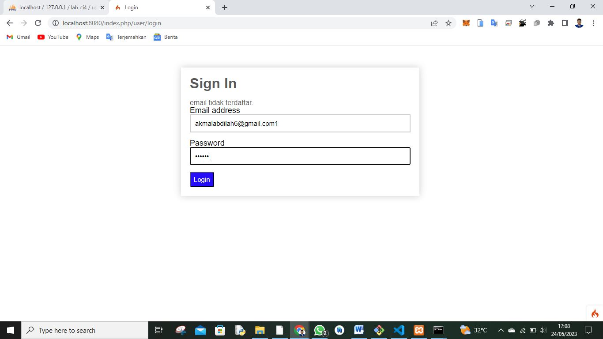

Gambar 18. Login_admin email tidak terdaftar

# **`Tambah Menu Navigasi admin dan Logout`**

Saya sudah menambahkan Menu admin :

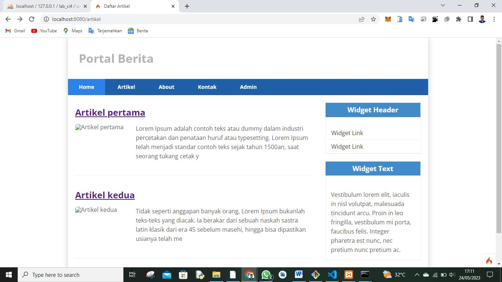

Gambar 19. Tampilan artikel_Nav_Admin

Setelah masuk Admin Maka akan di arahkan ke halam Artikel/admin/indek : Admin Portal Berita

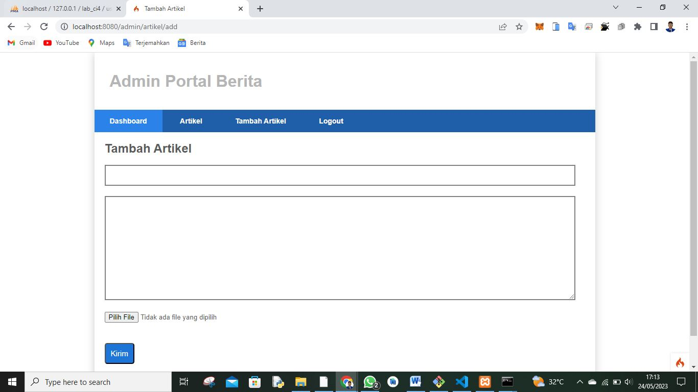

Gambar 20. Tampilan Admin_portal_berita_tambah

Setelah masuk **Admin portal_berita > tambah Artikel** Maka akan masuk ke Login : saya masukkan Email & pasword admin


Gambar 21. Tampilan Admin_portal_berita_tambah_login

Setelah berhasil Tambah artikel 

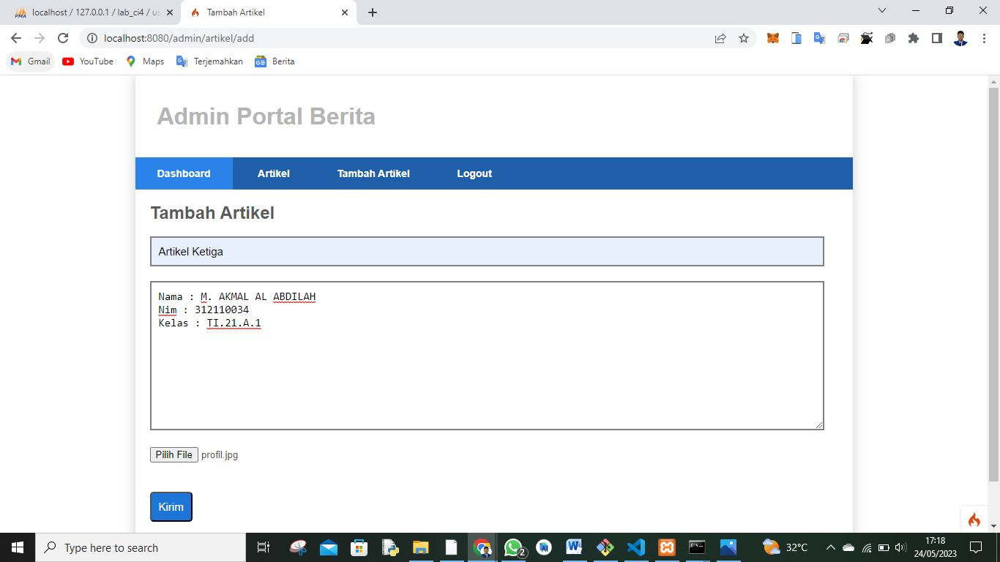

Gambar 22. Tampilan Admin_portal_berita_tambah_artikel

Berikut tampilan artikel berhasil di tambahkan.

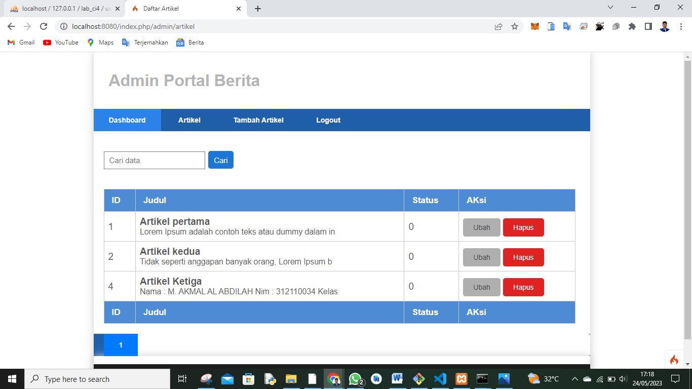

Gambar 23. Tampilan Admin_portal_berita_tambah_artikel

Selanjutnya saya akan mencoba menu Logout :


Gambar 24. Tampilan Nav_Logout

Setelah itu kita akan di arahkan ke halaman Login kembali

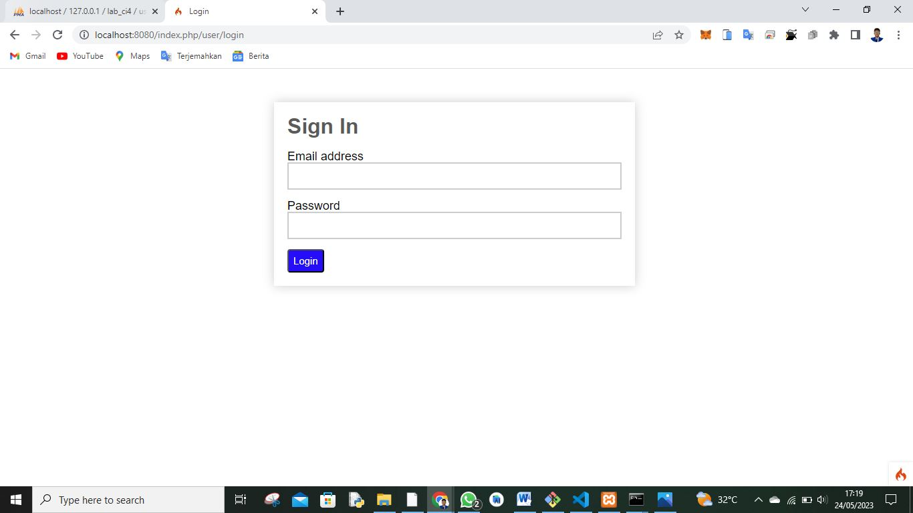

Gambar 25. Tampilan Nav_Logout-Login

**`Apabila kita mau masuk halan Admin kita masukkan kembali Email dan password tapi kalau kita keluar tinggal kita close browser`**

Cukup Sekian Penjelasan dari saya.

**SELESAI**

<div>
<h2 align="center">Thanks For Reading!!!</h2>
<div align="center">

